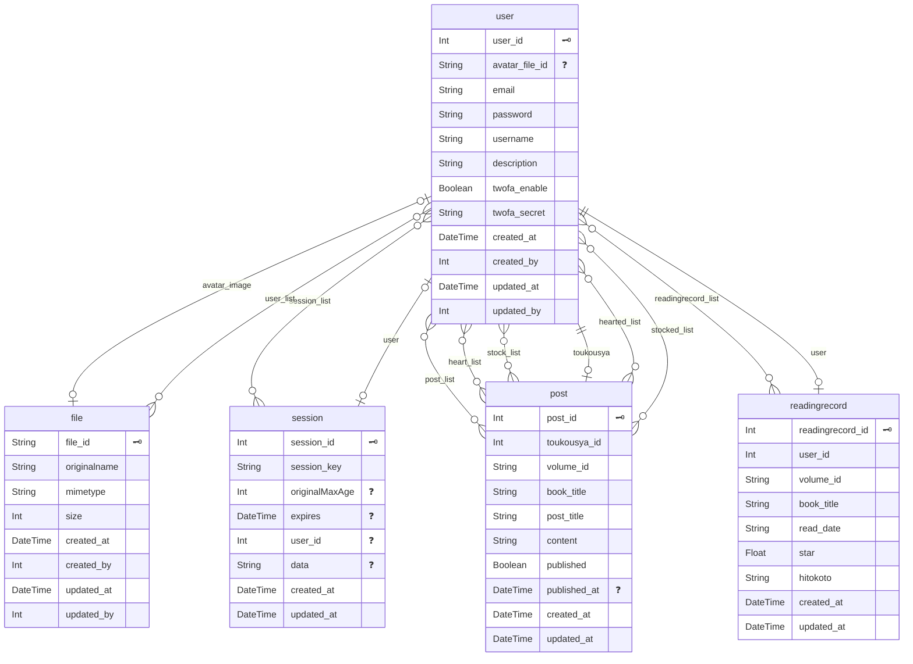

```mermaid
erDiagram

  "user" {
    Int user_id "🗝️"
    String avatar_file_id "❓"
    String email 
    String password 
    String username 
    String description 
    Boolean twofa_enable 
    String twofa_secret 
    DateTime created_at 
    Int created_by 
    DateTime updated_at 
    Int updated_by 
    }
  

  "session" {
    Int session_id "🗝️"
    String session_key 
    Int originalMaxAge "❓"
    DateTime expires "❓"
    Int user_id "❓"
    String data "❓"
    DateTime created_at 
    DateTime updated_at 
    }
  

  "file" {
    String file_id "🗝️"
    String originalname 
    String mimetype 
    Int size 
    DateTime created_at 
    Int created_by 
    DateTime updated_at 
    Int updated_by 
    }
  

  "post" {
    Int post_id "🗝️"
    Int toukousya_id 
    String volume_id 
    String book_title 
    String post_title 
    String content 
    Boolean published 
    DateTime published_at "❓"
    DateTime created_at 
    DateTime updated_at 
    }
  

  "readingrecord" {
    Int readingrecord_id "🗝️"
    Int user_id 
    String volume_id 
    String book_title 
    String read_date 
    Float star 
    String hitokoto 
    DateTime created_at 
    DateTime updated_at 
    }
  
    "user" o|--|o "file" : "avatar_image"
    "user" o{--}o "session" : "session_list"
    "user" o{--}o "post" : "post_list"
    "user" o{--}o "post" : "heart_list"
    "user" o{--}o "post" : "stock_list"
    "user" o{--}o "readingrecord" : "readingrecord_list"
    "session" o|--|o "user" : "user"
    "file" o{--}o "user" : "user_list"
    "post" o|--|| "user" : "toukousya"
    "post" o{--}o "user" : "hearted_list"
    "post" o{--}o "user" : "stocked_list"
    "readingrecord" o|--|| "user" : "user"
```
