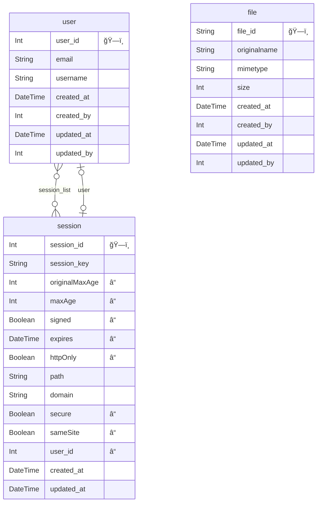

```mermaid
erDiagram

  "user" {
    Int user_id "ğŸ—ï¸"
    String email 
    String username 
    DateTime created_at 
    Int created_by 
    DateTime updated_at 
    Int updated_by 
    }
  

  "session" {
    Int session_id "ğŸ—ï¸"
    String session_key 
    Int originalMaxAge "â“"
    Int maxAge "â“"
    Boolean signed "â“"
    DateTime expires "â“"
    Boolean httpOnly "â“"
    String path 
    String domain 
    Boolean secure "â“"
    Boolean sameSite "â“"
    Int user_id "â“"
    DateTime created_at 
    DateTime updated_at 
    }
  

  "file" {
    String file_id "ğŸ—ï¸"
    String originalname 
    String mimetype 
    Int size 
    DateTime created_at 
    Int created_by 
    DateTime updated_at 
    Int updated_by 
    }
  
    "user" o{--}o "session" : "session_list"
    "session" o|--|o "user" : "user"
```
